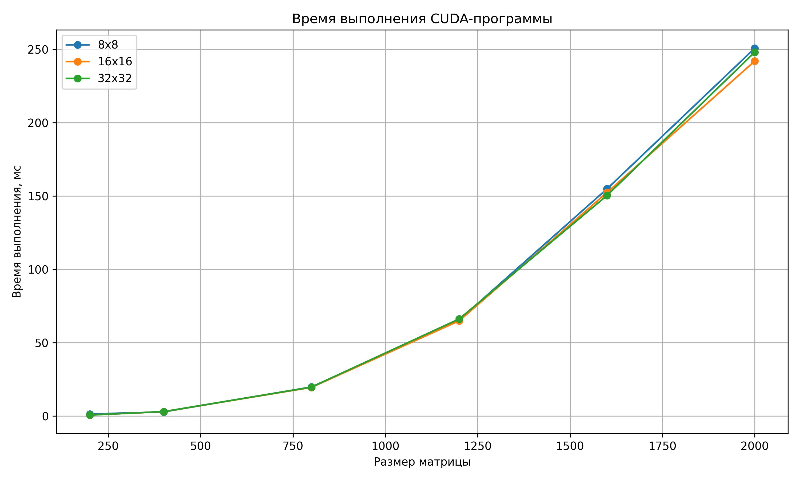
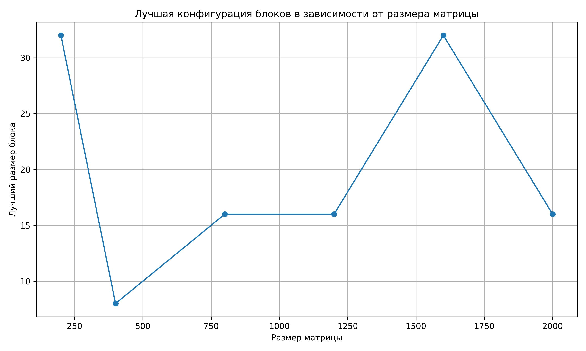

# Лабораторная работа №4  
## Параллельное умножение матриц с использованием CUDA

### Задание

Модифицировать программу из л/р №1 для параллельной работы по технологии CUDA.  
Провести эксперименты с разными размерами матриц и различными конфигурациями сетки блоков.

---

## Описание задачи

Была реализована программа умножения квадратных матриц с использованием CUDA.  

Каждый поток GPU вычисляет один элемент результирующей матрицы.  
Распределение работы происходит по двумерной сетке блоков и потоков.

---

## Программа

- `matrix_mul_cuda.cu` — программа параллельного умножения квадратных матриц с использованием CUDA
- `run_cuda_experiments.py` — скрипт для автоматического запуска серии экспериментов
- `make_plots.py` — скрипт для построения графиков по результатам экспериментов
- `verify.py` — скрипт для автоматической проверки корректности результата
- `cuda_results.csv` — файл с результатами экспериментов
- `matrix_a.txt`, `matrix_b.txt` — входные данные
- `result.txt` — файл с результатом умножения матриц

---

## Алгоритм

Для каждого элемента результирующей матрицы:

```text
C[i][j] = Σ A[i][k] * B[k][j]
```

Каждый поток вычисляет один элемент `C[row][col]`.

---

## Эксперименты

Проводились эксперименты для размеров матриц:

- 200 × 200  
- 400 × 400  
- 800 × 800  
- 1200 × 1200  
- 1600 × 1600  
- 2000 × 2000  

И конфигураций блоков:

- 8 × 8  
- 16 × 16  
- 32 × 32  

---

## Результаты

| Размер | 8x8 (мс) | 16x16 (мс) | 32x32 (мс) |
|--------|---------|-----------|-----------|
| 200    | 1.227   | 0.6037    | 0.5809    |
| 400    | 2.737   | 2.8573    | 2.9101    |
| 800    | 19.6923 | 19.4299   | 19.6265   |
| 1200   | 65.4767 | 64.8586   | 66.127    |
| 1600   | 154.831 | 152.335   | 150.328   |
| 2000   | 250.799 | 242.029   | 248.106   |

---

## Графики

### Время выполнения



### Лучшая конфигурация блоков



---

## Вывод

В ходе работы была реализована CUDA-программа умножения матриц и проведено исследование влияния конфигурации блоков на производительность.

Результаты показали, что:

- время выполнения растет с увеличением размера матрицы  
- конфигурация блоков влияет на производительность  
- наиболее эффективными чаще всего являются блоки **16×16 и 32×32**  
- для разных размеров матриц оптимальный размер блока может отличаться  

Использование GPU позволяет значительно ускорить вычисления по сравнению с последовательным выполнением.