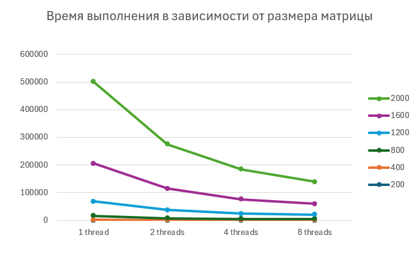
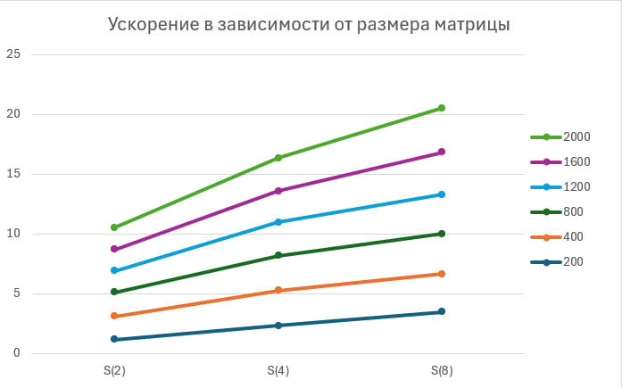

# Лабораторная работа №2

## 1. Задание

Модифицировать программу из лабораторной работы №1 для параллельной работы по технологии OpenMP.  
Провести серию экспериментов с разным количеством потоков (1, 2, 4, 8), разными размерами матриц (200, 400, 800, 1200, 1600, 2000).

## 2. Программа

- `matrix_mul.cpp` — параллельное умножение квадратных матриц с использованием OpenMP
- `verify.py` — автоматическая верификация результата
- `run_lab2.py` — запуск серии экспериментов

## 3. Результаты

### Объем задачи

Для квадратной матрицы размера `n x n` объем задачи вычислялся по формуле:

```text
V = n^3 + n^2 (n - 1)
```

200x200: 15 960 000 операций

400x400: 127 840 000 операций

800x800: 1 023 360 000 операций

1200x1200: 3 454 560 000 операций

1600x1600: 8 189 440 000 операций

2000x2000: 15 996 000 000 операций

Таблица времени выполнения
| Размер    | 1 поток, мс | 2 потока, мс | 4 потока, мс | 8 потоков, мс |
| --------- | ----------: | -----------: | -----------: | ------------: |
| 200x200   |     185.064 |      158.202 |      79.6691 |       53.0013 |
| 400x400   |     1506.45 |      780.895 |      509.319 |       478.448 |
| 800x800   |     14232.1 |      7004.95 |      4931.95 |       4237.33 |
| 1200x1200 |       52634 |      29261.7 |      18748.3 |       15969.9 |
| 1600x1600 |      136954 |      77639.3 |      52001.8 |         38575 |
| 2000x2000 |      295064 |       160307 |       108037 |       80272.3 |

Таблица ускорения

Ускорение рассчитывалось по формуле:

```text
S = T1 / Tp
```

| Размер    |  S(2) |  S(4) |  S(8) |
| --------- | ----: | ----: | ----: |
| 200x200   | 1.170 | 2.323 | 3.492 |
| 400x400   | 1.929 | 2.958 | 3.149 |
| 800x800   | 2.032 | 2.886 | 3.359 |
| 1200x1200 | 1.799 | 2.807 | 3.296 |
| 1600x1600 | 1.764 | 2.634 | 3.550 |
| 2000x2000 | 1.841 | 2.731 | 3.676 |

Графики





Верификация

Во всех проведенных экспериментах результаты автоматической проверки совпали с результатами программы.

## 4. Выводы

В ходе лабораторной работы программа умножения квадратных матриц была модифицирована для параллельной работы с использованием OpenMP. Проведенные эксперименты показали, что при увеличении числа потоков время выполнения уменьшается. Наибольшее ускорение наблюдается на больших размерах матриц. При этом ускорение растет не линейно, так как на эффективность влияют накладные расходы на распараллеливание и ограничения вычислительной системы. Во всех экспериментах корректность вычислений была подтверждена автоматической верификацией.